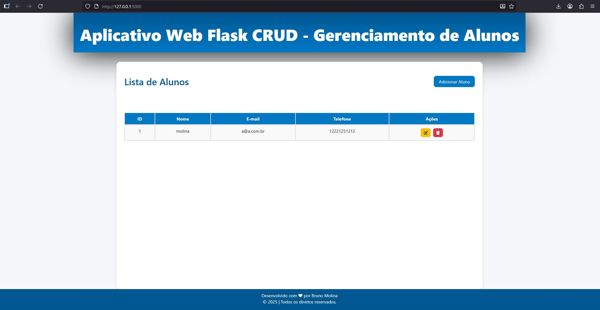
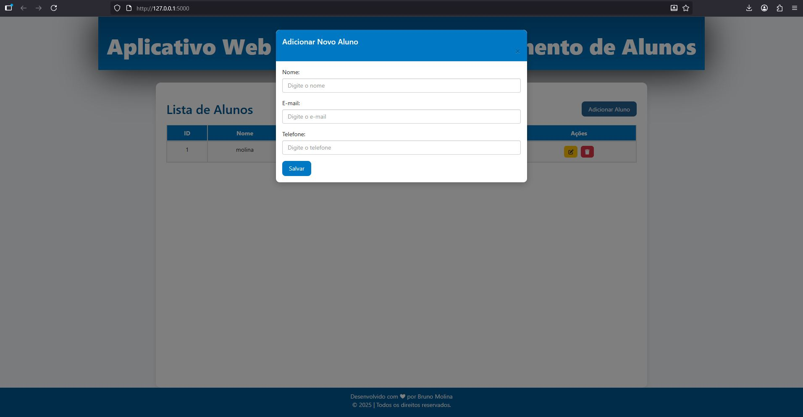

# 
Aplicativo CRUD em Python Flask

## Exemplo de um aplicativo web CRUD usando Python, Flask e MySQL. CRUD significa Criar, Ler, Atualizar e Excluir registros.

Este aplicativo permite:

Adicionar novos alunos;

Visualizar registros existentes;

Atualizar informações de alunos;

Excluir registros.

# O código contém comentários explicativos para facilitar o aprendizado e entendimento do funcionamento do aplicativo.

## Tecnologias utilizadas

Back-end: Python com Flask

Front-end: HTML, CSS e Bootstrap

Banco de dados: MySQL

# Como executar

## Instale as dependências:

pip install Flask

## Execute o aplicativo:

python app.py

## Acesse a interface no navegador:

https://localhost:5000/

# Pré-visualização

